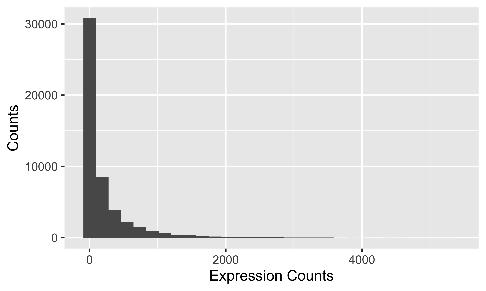
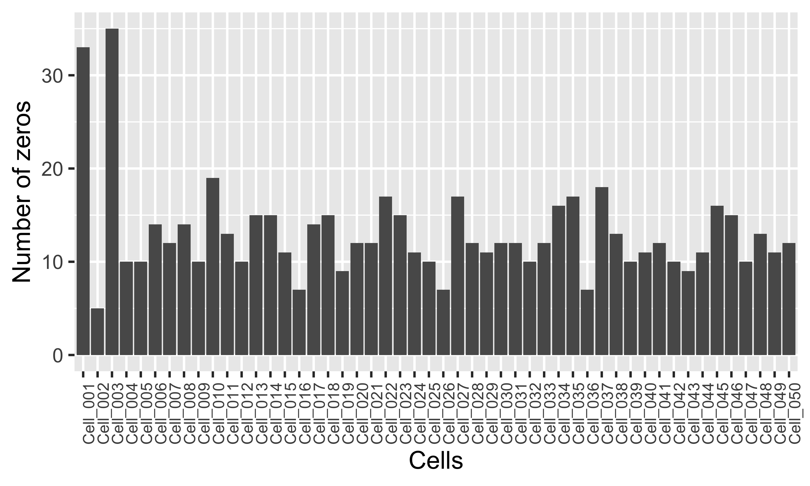
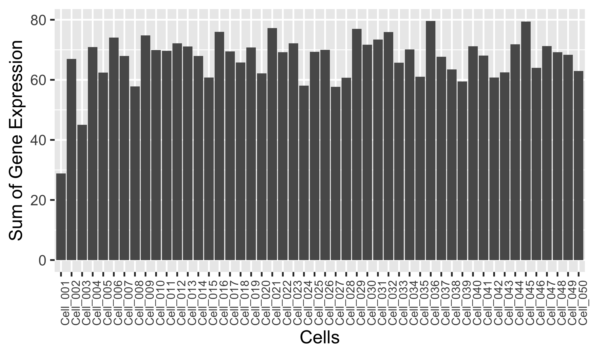
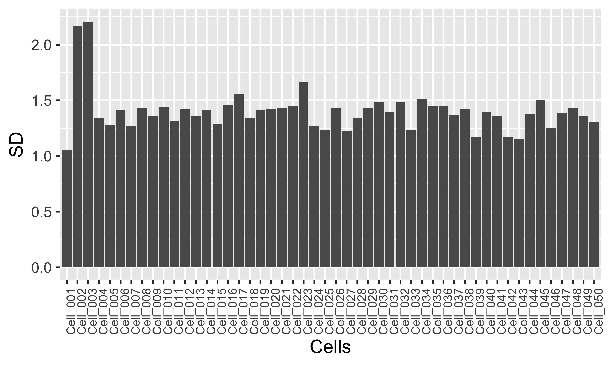
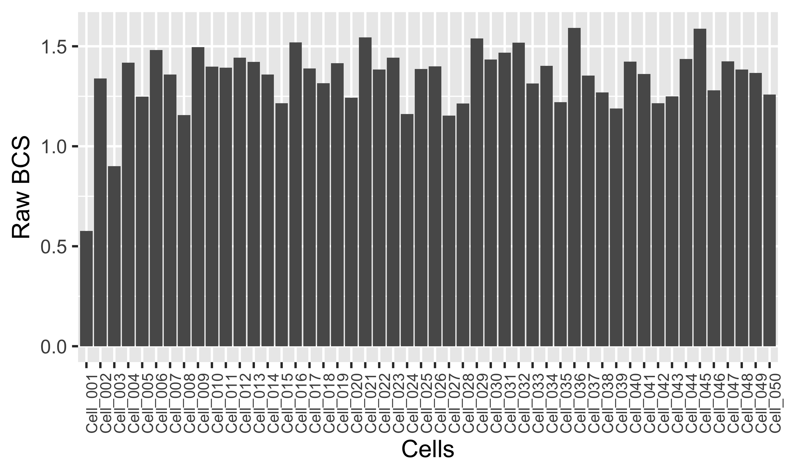
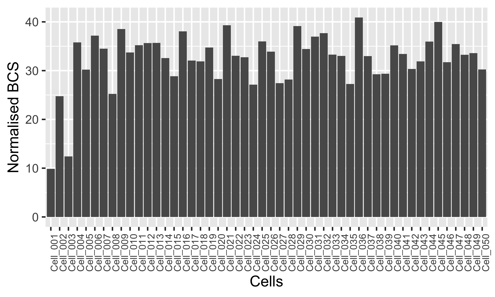
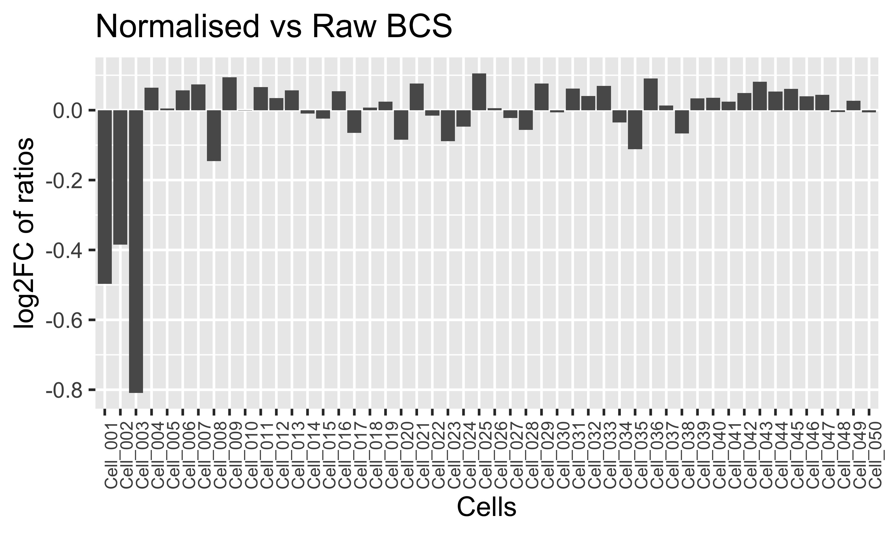

# Beyondcell Score Normalization

Beyondcell scores are normalised in order to **penalise** cells with a
great number of **zeros** and/or cells with **outliers** (genes whose
expression is much higher than the rest of genes within the same cell).

In this vignette we try to demonstrate the effect of this normalization
using a mock single-cell experiment.

## Beyondcell score calculation

To compute the Beyondcell score (BCS) for a mode *M = {UP, DN}*
we perform two steps:

1.  Compute raw BCS
2.  Normalise these scores

### Compute raw BCS

Suppose we have a single-cell expression matrix, which we call *X*, that
has *n* rows and *m* columns. In this matrix, rows correspond to genes
and columns to cells. Thus, we have a set of *n* genes
*I* = {*i*<sub>1</sub>, *i*<sub>2</sub>, ..., *i*<sub>*n*</sub>} and a
set of *m* cells
*J* = {*j*<sub>1</sub>, *j*<sub>2</sub>, ..., *j*<sub>*m*</sub>}. Also,
we have a geneset
*G*<sub>*M*</sub> = {*S*<sub>*M*, 1</sub>, *S*<sub>*M*, 2</sub>, ..., *S*<sub>*M*, *p*</sub>},
which is a set of set of genes (called signatures and denoted as
*S*<sub>*M*, *p*</sub>) per mode *M = {UP, DN}*.

Suppose we are interested in computing the raw BCS of a signature
*S*<sub>*M*</sub>. The first step would be to calculate the common genes
between *I* and *S*<sub>*M*</sub>.

```math
G_{M,S_M} = I \cap S_M = \{g_1, g_2, ..., g_q\}
```

Then, we subset *X* to keep only the genes present in
*G*<sub>*M*, *S*<sub>*M*</sub></sub>. We call this subsetted matrix *Y*,
which has *q* rows and *m* cells. The raw score for each cell *j* is the
mean expression of the genes in *G*<sub>*M*, *S*<sub>*M*</sub></sub>.

```math
raw_{M,S_M,j} = \frac{1}{|G_{M,S_M}|} \cdot \sum_{k=1}^q{y_{kj}} = \bar{y_j}
```

### Normalise raw BCS

Finally, we normalise the raw scores using the sum, mean and standard
deviation of the total gene expression per cell.

```math
norm_{M,S_M,j} = raw_{M,S_M,j} \cdot
```

The normalization factor *f* can be decomposed as follows:

```math
f = \frac{\sum_{k=1}^q{y_{kj}} - \sqrt{\frac{\sum_{k=1}^q{(y_{kj} - \bar{y_j})^2}}{q-1}}}{\bar{y_j} + \sqrt{\frac{\sum_{k=1}^q{(y_{kj} - \bar{y_j})^2}}{q-1}}}
```

```math
f = \frac{sumexpr - sd}{mean + sd}
````

Thus, **the higher the standard deviation the lower *f***. This results
in a higher penalization of the raw score for cells with genes that are
much more expressed than the rest of genes within the same cell.
Moreover, **the lower the *mean* and *sumexpr*, the lower *f***, which further 
penalises cells with a great number of zeros.

## Example

``` r
library(scater)
library(ggplot2)
library(Seurat)
library(stringr)
library(proxyC)
library(dplyr)
# Random seed for reproducibility
set.seed(123)
```

We create a mock single-cell expression matrix *X* with *n* genes and
*m* cells.

``` r
n <- 1000
m <- 50
X <- scater::mockSCE(ngenes = n, ncells = m)
head(assay(X)[, 1:5])
#>           Cell_001 Cell_002 Cell_003 Cell_004 Cell_005
#> Gene_0001       22        4       21       13        0
#> Gene_0002        0        0        0        3        4
#> Gene_0003      227       84      180       13      107
#> Gene_0004      166      152      313      284      358
#> Gene_0005      471       43      160      999      326
#> Gene_0006        0       58        0      123        0
```

We draw the histogram of the counts to see its distribution. We can
observe that there is a high proportion of zeros, as one would expect
from a single-cell experiment.

``` r
df <- data.frame(counts = as.vector(assay(X)))
ggplot(df, aes(counts)) + geom_histogram() + xlab("Expression Counts") + 
  ylab("Counts")
```



We also print a summary of the raw counts.

``` r
summary(df$counts)
#>    Min. 1st Qu.  Median    Mean 3rd Qu.    Max. 
#>       0       1      38     200     221    5344
```

We can observe than the max is 5344 and the mean and median are 200 and
38 respectively.

Next, we are going to make up three cells in order to illustrate how the
normalization process works. `Cell_0001` will have a high number of
zeros, whereas `Cell_0002` will present few genes with an expression of
20-40 times the maximum expression of our mock experiment. `Cell_0003`
will combine these two conditions.

``` r
# Cell_0001
assay(X)[sample(1:50, size = 30), 1] <- 0
# Cell_0002
assay(X)[sample(1:50, size = 5), 2] <- sample(100000:200000, size = 5, 
                                              replace = TRUE)
# Cell_0003
zero_idx <- sample(1:50, size = 30)
high_idx <- sample(which(!1:50 %in% zero_idx), size = 5)
assay(X)[zero_idx, 3] <- 0
assay(X)[high_idx, 3] <- sample(100000:200000, size = 5, replace = TRUE)
# Resulting X
head(assay(X)[, 1:5])
#>           Cell_001 Cell_002 Cell_003 Cell_004 Cell_005
#> Gene_0001        0        4       21       13        0
#> Gene_0002        0        0        0        3        4
#> Gene_0003        0       84      180       13      107
#> Gene_0004      166      152   127237      284      358
#> Gene_0005      471       43        0      999      326
#> Gene_0006        0       58        0      123        0
```

Then, we create a Seurat object

``` r
X <- CreateSeuratObject(counts = assay(X))
#> Warning: The following arguments are not used: row.names
#> Warning: Feature names cannot have underscores ('_'), replacing with dashes
#> ('-')
```

Note that these counts are raw, and Beyondcell requires normalized
counts. So the next step is to normalize *X*.

``` r
DefaultAssay(X) <- "RNA"
X <- NormalizeData(X, normalization.method = "LogNormalize", 
                   scale.factor = 10000)
# We extract the normalized counts and store them as a sparse matrix
X <- GetAssayData(X, slot = "data", assay = DefaultAssay(X))
head(X[, 1:5])
#> 6 x 5 sparse Matrix of class "dgCMatrix"
#>           Cell_001  Cell_002  Cell_003  Cell_004  Cell_005
#> Gene-0001 .        0.0417541 0.2120372 0.4667703 .        
#> Gene-0002 .        .         .         0.1286303 0.1721812
#> Gene-0003 .        0.6394295 1.1067521 0.4667703 1.7961068
#> Gene-0004 2.255412 0.9632683 7.2668807 2.6386899 2.8801212
#> Gene-0005 3.227985 0.3773119 .         3.8439750 2.7919800
#> Gene-0006 .        0.4813465 .         1.8913113 .
```

Now we are ready to compute the BCS. We are doing so for a signature of
*q* genes
*S*<sub>*M*</sub> = {*g*<sub>1</sub>, *g*<sub>2</sub>, ..., *g*<sub>*q*</sub>}.

``` r
q <- 50
SM <- paste0("Gene-", stringr::str_pad(1:q, 4, pad = "0"))
```

We subset *X* to keep only the genes present in *S*<sub>*M*</sub>. We
call this subset *Y*.

``` r
Y <- X[SM, ]
stats_df <- data.frame(Cells = colnames(Y), nzeros = colZeros(Y))
# Number of zeros per cell
ggplot(stats_df, aes(x = Cells, y = nzeros)) + geom_bar(stat = "identity") + 
  theme(axis.text.x = element_text(angle = 90, size = 7)) + 
  ylab("Number of zeros")
```



We can observe than `Cell_0001` and `Cell_0003` have much more zeros
than the rest of cells.

Then, we compute the raw score (mean of expression) of each cell.

``` r
stats_df <- stats_df %>% mutate(raw = colMeans(Y))
# Raw score per cell
ggplot(stats_df, aes(x = Cells, y = raw)) + geom_bar(stat = "identity") +
  theme(axis.text.x = element_text(angle = 90, size = 7)) + ylab("Raw BCS")
```


In this case `Cell_0001` has the lowest raw BCS, followed by
`Cell_0003`. In contrast, `Cell_0002` score is similar to the raw BCS of
the rest of cells.

The next step is to compute the components of the normalization factor.

``` r
stats_df <- stats_df %>% mutate(sumexpr = colSums(Y), sd = apply(Y, 2, sd))
# Sum of gene expression per cell
ggplot(stats_df, aes(x = Cells, y = sumexpr)) + geom_bar(stat = "identity") +
  theme(axis.text.x = element_text(angle = 90, size = 7)) + 
  ylab("Sum of Gene Expression")
```



``` r
# Standard deviation per cell
ggplot(stats_df, aes(x = Cells, y = sd)) + geom_bar(stat = "identity") +
  theme(axis.text.x = element_text(angle = 90, size = 7)) + ylab("SD")
```



On one hand, we can see that the sum of gene expression is proportional
to the mean. On the other hand, in the second bar plot we observe that
`Cell_0001` has the minimum and `Cell_0002` and `Cell_0003` have the
maximum standard deviation.

Finally, we compute *f* and compare the raw and the normalised BCS.

``` r
stats_df <- stats_df %>% mutate(f = (sumexpr - sd)/(raw + sd))
stats_df <- stats_df %>% mutate(norm = raw * f)
# Raw score per cell
ggplot(stats_df, aes(x = Cells, y = raw)) + geom_bar(stat = "identity") +
  theme(axis.text.x = element_text(angle = 90, size = 7)) + ylab("Raw BCS")
```



``` r
# Normalised score per cell
ggplot(stats_df, aes(x = Cells, y = norm)) + geom_bar(stat = "identity") +
  theme(axis.text.x = element_text(angle = 90, size = 7)) + 
  ylab("Normalised BCS")
```



When comparing these two last bar plots, we can observe than
Beyondcell’s normalization step penalises cells with a great number of
zeros (`Cell_0001`), cells with outliers (`Cell_0002`) or cells that
satisfy these two conditions simultaneously (`Cell_0003`).

Numerically, we can compute the ratio of each score with respect to
their mean and compare these two measures by calculating the log fold
change.

``` r
stats_df <- stats_df %>% mutate(log2FC = log2((norm/mean(norm))/(raw/mean(raw))))
# Log2Fold Change of normalized vs raw
ggplot(stats_df, aes(x = Cells, y = log2FC)) + geom_bar(stat = "identity") +
  theme(axis.text.x = element_text(angle = 90, size = 7)) + 
  ylab("log2FC of ratios") + ggtitle("Normalised vs Raw BCS")
```



As we can see, the BCS is reduced drastically after normalization for
cells 1 to 3. This means that these three cells are the ones most
penalised by the normalization method.

``` r
sessionInfo()
#> R version 4.0.5 (2021-03-31)
#> Platform: x86_64-apple-darwin13.4.0 (64-bit)
#> Running under: macOS Big Sur 10.16
#> 
#> Matrix products: default
#> BLAS/LAPACK: /Users/mjjimenez/miniconda3/envs/devs/lib/libopenblasp-r0.3.15.dylib
#> 
#> locale:
#> [1] es_ES.UTF-8/es_ES.UTF-8/es_ES.UTF-8/C/es_ES.UTF-8/es_ES.UTF-8
#> 
#> attached base packages:
#> [1] parallel  stats4    stats     graphics  grDevices utils     datasets 
#> [8] methods   base     
#> 
#> other attached packages:
#>  [1] dplyr_1.0.6                 proxyC_0.2.0               
#>  [3] stringr_1.4.0               SeuratObject_4.0.1         
#>  [5] Seurat_4.0.2                scater_1.18.6              
#>  [7] ggplot2_3.3.3               SingleCellExperiment_1.12.0
#>  [9] SummarizedExperiment_1.20.0 Biobase_2.50.0             
#> [11] GenomicRanges_1.42.0        GenomeInfoDb_1.26.4        
#> [13] IRanges_2.24.1              S4Vectors_0.28.1           
#> [15] BiocGenerics_0.36.0         MatrixGenerics_1.2.1       
#> [17] matrixStats_0.59.0         
#> 
#> loaded via a namespace (and not attached):
#>   [1] plyr_1.8.6                igraph_1.2.6             
#>   [3] lazyeval_0.2.2            splines_4.0.5            
#>   [5] BiocParallel_1.24.1       listenv_0.8.0            
#>   [7] scattermore_0.7           digest_0.6.27            
#>   [9] htmltools_0.5.1.1         viridis_0.6.1            
#>  [11] fansi_0.5.0               magrittr_2.0.1           
#>  [13] tensor_1.5                cluster_2.1.2            
#>  [15] ROCR_1.0-11               globals_0.14.0           
#>  [17] RcppParallel_5.1.4        spatstat.sparse_2.0-0    
#>  [19] colorspace_2.0-1          ggrepel_0.9.1            
#>  [21] xfun_0.23                 crayon_1.4.1             
#>  [23] RCurl_1.98-1.3            jsonlite_1.7.2           
#>  [25] spatstat.data_2.1-0       survival_3.2-11          
#>  [27] zoo_1.8-9                 glue_1.4.2               
#>  [29] polyclip_1.10-0           gtable_0.3.0             
#>  [31] zlibbioc_1.36.0           XVector_0.30.0           
#>  [33] leiden_0.3.8              DelayedArray_0.16.3      
#>  [35] BiocSingular_1.6.0        future.apply_1.7.0       
#>  [37] abind_1.4-5               scales_1.1.1             
#>  [39] miniUI_0.1.1.1            Rcpp_1.0.6               
#>  [41] viridisLite_0.4.0         xtable_1.8-4             
#>  [43] reticulate_1.20           spatstat.core_2.1-2      
#>  [45] rsvd_1.0.5                htmlwidgets_1.5.3        
#>  [47] httr_1.4.2                RColorBrewer_1.1-2       
#>  [49] ellipsis_0.3.2            ica_1.0-2                
#>  [51] farver_2.1.0              pkgconfig_2.0.3          
#>  [53] scuttle_1.0.4             uwot_0.1.10              
#>  [55] deldir_0.2-10             utf8_1.2.1               
#>  [57] labeling_0.4.2            tidyselect_1.1.1         
#>  [59] rlang_0.4.11              reshape2_1.4.4           
#>  [61] later_1.2.0               munsell_0.5.0            
#>  [63] tools_4.0.5               generics_0.1.0           
#>  [65] ggridges_0.5.3            evaluate_0.14            
#>  [67] fastmap_1.1.0             yaml_2.2.1               
#>  [69] goftest_1.2-2             knitr_1.33               
#>  [71] fitdistrplus_1.1-3        purrr_0.3.4              
#>  [73] RANN_2.6.1                pbapply_1.4-3            
#>  [75] future_1.21.0             nlme_3.1-152             
#>  [77] sparseMatrixStats_1.2.1   mime_0.10                
#>  [79] compiler_4.0.5            beeswarm_0.3.1           
#>  [81] plotly_4.9.3              png_0.1-7                
#>  [83] spatstat.utils_2.1-0      tibble_3.1.2             
#>  [85] stringi_1.6.2             highr_0.9                
#>  [87] lattice_0.20-44           Matrix_1.3-4             
#>  [89] vctrs_0.3.8               pillar_1.6.1             
#>  [91] lifecycle_1.0.0           spatstat.geom_2.1-0      
#>  [93] lmtest_0.9-38             RcppAnnoy_0.0.18         
#>  [95] BiocNeighbors_1.8.2       data.table_1.14.0        
#>  [97] cowplot_1.1.1             bitops_1.0-7             
#>  [99] irlba_2.3.3               httpuv_1.6.1             
#> [101] patchwork_1.1.1           R6_2.5.0                 
#> [103] promises_1.2.0.1          KernSmooth_2.23-20       
#> [105] gridExtra_2.3             vipor_0.4.5              
#> [107] parallelly_1.25.0         codetools_0.2-18         
#> [109] MASS_7.3-54               withr_2.4.2              
#> [111] sctransform_0.3.2         GenomeInfoDbData_1.2.4   
#> [113] mgcv_1.8-36               grid_4.0.5               
#> [115] rpart_4.1-15              beachmat_2.6.4           
#> [117] tidyr_1.1.3               rmarkdown_2.8            
#> [119] DelayedMatrixStats_1.12.3 Rtsne_0.15               
#> [121] shiny_1.6.0               ggbeeswarm_0.6.0
```
