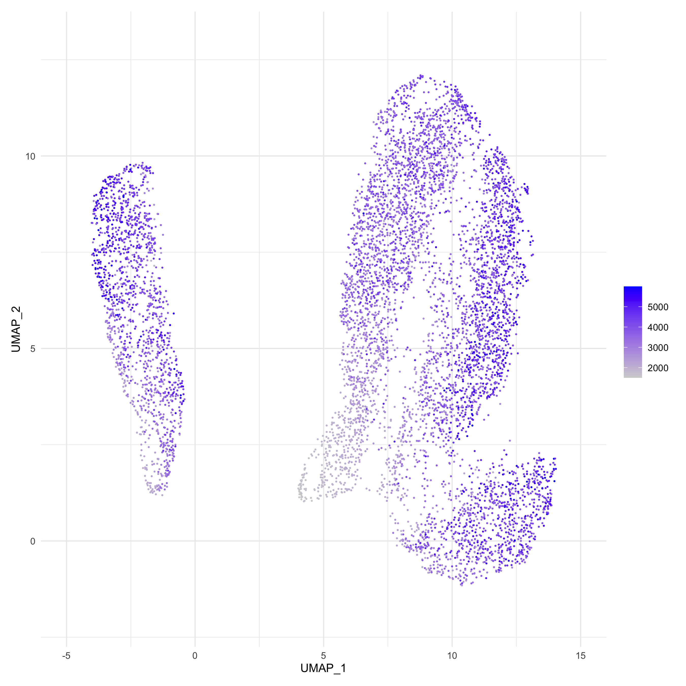
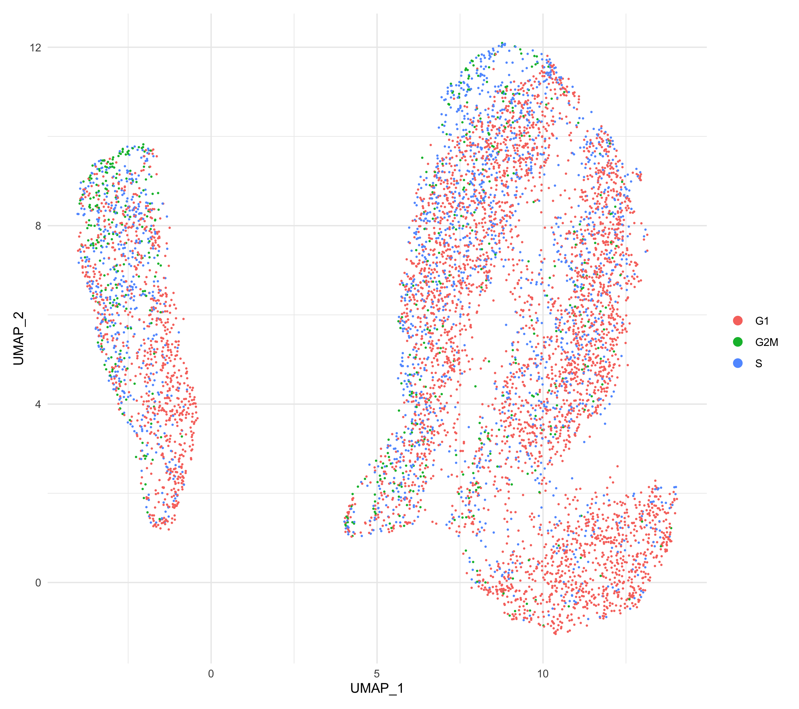
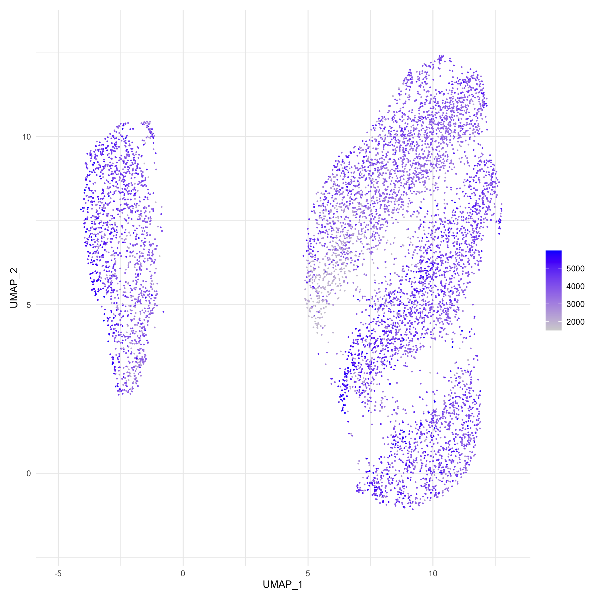

# Analysis workflow

## Data access:
We have validated Beyondcell in a population of MCF7-AA cells exposed to 500nM 
of bortezomib and collected at different time points: t0 (before treatment), 
t12, t48 and t96 (72h treatment followed by drug wash and 24h of recovery) 
obtained from *Ben-David U, et al., Nature, 2018*. We integrated all four 
conditions using the Seurat pipeline. To follow this tutorial, the resulting 
`Seurat` object can be accessed through the following 
[link](https://zenodo.org/record/4438620). 

## Using Beyondcell
For a correct analysis with **Beyondcell**, users should follow these steps: 

 1. Read a single-cell expression object
 2. Compute the Beyondcell Scores (BCS)
 3. Compute the Therapeutic Clusters (TCs)
    * Check the clustering and look for unwanted sources of variation
    * Regress out unwanted sources of variation
    * Recompute the UMAP reduction
 4. Compute ranks
 5. [Visualize](https://gitlab.com/bu_cnio/Beyondcell/-/tree/master/tutorial/visualization) 
 the results

### 1. Read a single-cell expression object
Beyondcell can accept both a single-cell matrix or a `Seurat` object. In order 
to correctly compute the scores, the transcriptomics data needs to be 
pre-processed. This means that proper cell-based quality control filters, as 
well as normalization and scaling of the data, should be applied prior to the 
analysis with Beyondcell.

> Note: We recommend using a `Seurat` object.

```r
library("beyondcell")
library("Seurat")
set.seed(1)
# Read single-cell experiment.
sc <- readRDS(path_to_sc)
```

Note that if you are using a `Seurat` object, the `DefaultAssay` must be 
specified. Both `SCT` and `RNA` assays are accepted.

```r
# Set Assay.
DefaultAssay(sc) <- "RNA"
```

### 2. Compute the BCS
We need to perform two steps:

#### Get a geneset object with the signatures of interest
In order to compute the BCS, we also need a `geneset` object containing the drug 
(and optionally the functional) signatures we are interested in evaluating. To 
create this object, the `GenerateGenesets` function needs to be called. 
Beyondcell includes two drug signature collections that are ready to use:

 * **Drug Perturbation Signatures collection (PSc):** Captures the 
 transcriptional changes induced by a drug.
 * **Drug Sensitivity Signatures collection (SSc):** Captures the sensitivity to a given drug.

A small collection of functional pathways will be included by default in your 
`geneset` object. These pathways are related to the regulation of the 
epithelial-mesenchymal transition (EMT), cell cycle, proliferation, senescence 
and apoptosis. PSc and SSc can also be filtered according to several values. 

```r
# Generate geneset object with one of the ready to use signature collections.
gs <- GenerateGenesets(PSc)
# You can deactivate the functional pathways option if you are not interested in evaluating them.
nopath <- GenerateGenesets(PSc, include.pathways = FALSE)
```

Moreover, Beyondcell allows the user to input a GMT file containing the functional 
pathways/signatures of interest as well as numeric matrices containing a ranking 
criteria such as the t-statistic or logFoldChange. If x is a path to a GMT file, all gene sets must end in "_UP" or "_DOWN" to indicate the mode of each one. When x is a pre-loaded matrix, comparison is set automatically.

```r
# Generate geneset object with a custom GMT file. For direct comparisons:
gs <- GenerateGenesets(x = "path_to_gmt", comparison = "treated_vs_control")
# For indirect comparisons (the signatures will be reversed):
gs <- GenerateGenesets(x = "path_to_gmt", comparison = "sensitive_vs_resistant")
```

<!-- For further information please check [GenerateGenesets](https://gitlab.com/bu_cnio/Beyondcell/-/tree/master/tutorial/GenerateGenesets) tutorial. -->

#### Compute the BCS
```r
# Compute score for the PSc. This might take a few minutes depending on the size of your dataset.
bc <- bcScore(sc, gs, expr.thres = 0.1) 
```
> TIP: We recommend to input cells with at least 1000-1500 genes detected.


### 3. Compute the TCs
The ouput of the `bcScore` computation is a `beyondcell` object. This object 
contains the normalized and scaled **Beyondcell Scores** and the 
**Switch Points** (SPs), as well as information concerning the parameters used 
for the analysis. The `beyondcell` object can be used as an input for a 
dimensionality reduction and clustering analysis using the `bcUMAP`function. 
With this analysis, cells can be classified into distinct 
**Therapeutic Clusters**, that represent sets of cells sharing a common response 
to a particular drug exposition. The Uniform Manifold Approximation and 
Projection (UMAP) will allow the visualization of the identified clusters. 

> TIP: If `pc = NULL` (default), the function will stop prior to compute the 
UMAP projection and the TCs. This first step will print and elbow plot in your 
screen and will help you chose the number of components needed for the UMAP 
computation.

```r
# Run the UMAP reduction. 
bc <- bcUMAP(bc, k.neighbors = 4, res = 0.2, method = "umap-learn")
# Run the bcUMAP function again, specifying the number of principal components you want to use.
bc <- bcUMAP(bc, pc = 10, k.neighbors = 4, res = 0.2, method = "umap-learn")
```

**Check clustering**\
It is important to check whether any unwanted source of variation is guiding the 
clustering analysis. The `bcClusters` function allows us to colour the UMAP 
based on the metadata variables that migth be influencing this clustering. We 
recommend checking these sources of variation among others:

 * Number of detected genes per cell (`nFeature_RNA`)
 * Number of detected counts (`nCount_RNA`)
 * Cell cycle phase (`Phase`)
 * Batch

```r
# Visualize whether the cells are clustered based on the number of genes detected per each cell.
bcClusters(bc, UMAP = "beyondcell", idents = "nFeature_RNA", factor.col = FALSE)
```


```r
# Visualize whether the cells are clustered based on their cell cycle status.
bcClusters(bc, UMAP = "beyondcell", idents = "Phase", factor.col = TRUE)
```


> TIP: The cell cycle information must be present in `bc@meta.data` and can be 
obtained using Seurat's function `CellCycleScoring`

**Regress out unwanted sources of variation**\
The `bcRegressOut` function will allow us to correct existing sources of 
variation. Have in mind that the number of detected genes per cell will 
*always* have an inpact in the final score.

```r
bc <- bcRegressOut(bc, vars.to.regress = "nFeature_RNA")
```
> TIP: Is the regression step taking too long? Check the amount of NAs per cell 
of your `bc@normalized matrix`. You migth need to refine the filtering of your 
single-cell experiment based on the amount of detected features.

**Recompute the TCs**\
Once corrected, you will need to recompute the dimensionality reduction and 
clustering, in order to find the *true* **Therapeutic Clusters** present in your 
sample. 

```r
# Recompute the UMAP.
bc <- bcUMAP(bc, pc = 10, k.neighbors = 20, res = 0.2, method = "umap-learn")
# Visualize the UMAP.
bcClusters(bc, UMAP = "beyondcell", idents = "nFeature_RNA", factor.col = FALSE)
# Visualize the therapeutic clusters.
bcClusters(bc, UMAP = "beyondcell", idents = "bc_clusters_res.0.2")
```

<p float="left">
  
  
</p>

### 4. Compute ranks
A summary table can be obtained using the `bcRanks`function. This table includes 
metrics such as the SP, mean, median, sd, variance, min, max, proportion of NaN 
and residuals' mean of each signature. Also, a signature rank is computed taking 
into account the SP and the mean. This table aims to help you in the 
prioritization of drug candidates. 

```r
# Obtain general statistics.
bc <- bcRanks(bc)
# Obtain condition-based statistics.
bc <- bcRanks(bc, idents = "condition")
# Obtain unextended therapeutic cluster-based statistics.
bc <- bcRanks(bc, idents = "bc_clusters_res.0.2", extended = FALSE)
```
The summary tables are saved in the slot `@ranks` as a list of dataframes. You 
can access them as follows:

```r
# Explore the statistics table.
head(bc@ranks$general) 
head(bc@ranks$condition)
head(bc@ranks$bc_clusters_res.0.2)
```

> TIP: The ranking returned by `bcRanks` orders the drug signatures from most to 
least sensitive. This kind of rank might be useful if you want to find a drug to 
treat all your cells simultaneously. However, as Beyondcell allows to inspect 
the intratumoural heterogeneity (ITH) in a single-cell RNA-seq experiment, you 
may be interested in the specific drugs that are most/least effective against a 
particular cluster. In the later scenario, we recommend prioritizing drugs 
taking into account both the SP and residuals' mean. In order to facilitate the 
computation and visualization of this kind of rank, we have included the 
function `bc4Squares` in Beyondcell (see [visualization](https://gitlab.com/bu_cnio/Beyondcell/-/tree/master/tutorial/visualization) 
for more information).

> Concerning the SP: It is the scaled value where normalized negative scores 
switch to positive scores and vice versa. As an example, an all-sensitive 
dataset will have *SP = 0*, as there won’t be any negative normalized scores for 
that specific drug in the whole population. On the other hand, a dataset 
insensitive to a certain drug will be expected to have a *SP $\approx$ 1*. 
Intermediate SPs, as a contrast, will reflect that the dataset contains both 
susceptible and non-susceptible cells.

> **Note that the SP is not equivalent to the proportion of insensitive cells**
**to a given drug, although there's a positive correlation between these two**
**magnitudes.**

## Support
Additional information can be found in the package's documentation. If you have 
any question regarding the use of **Beyondcell**, feel free to submit an [issue](https://gitlab.com/bu_cnio/Beyondcell/issues).
